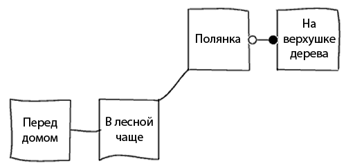

1. Пример игры *Хейди*
======================  

Пошагово рассмотрим написание простенькой игры *Хейди*, сюжет которой таков:

  «Хейди живёт в маленьком домике в лесу. Одним солнечным днём она слышит писк птички — её гнездо упало с ветки на поляну. Хейди кладёт птичку в гнездо, а гнездо обратно на ветку».

===============
Шаблон для игры
===============

Для начала создадим исходный файл-шаблон. Создайте папку ``Heidi`` в папке Информа (например, ``D:\RInform\Heidi\``), а в ней, при помощи текстового редактора, файл ``Heidi.inf`` со следующим содержимым::

    !% -SD
    !=============================================================================
    Include "CyrDef";

    Constant Story "Хейди";
    Constant Headline
        "^Пример простой игры на Inform.
         ^Авторы: Роджер Фирт (Roger Firth) и Соня Кессерих (Sonja Kesserich).
         ^Перевод Юрия Салтыкова a.k.a. G.A. Garinson^";
         
    Include "Parser";
    Include "VerbLib";
    !============================================================================
    ! Описание игровых объектов

    !============================================================================
    ! Функции инициализации

    [ Initialise; ];

    !============================================================================
    ! Стандартные и расширенные грамматики

    Include "RussiaG";
    !============================================================================

Пока можно просто скопировать и вставить этот текст; каждая строчка будет рассмотрена позднее. И убедитесь, что файл называется именно ``heidi.inf``, а не, например, ``heidi.txt`` (регистр значения не имеет).

В папке Информа (не в папке игры) с помощью текстового редактора создайте файл следующий файл ``heidi.bat``::

    inform-631.exe +lib-mod +charset_map=lib-mod\cyrwin.cm +language_name=Russian -v5 Heidi\Heidi.inf Heidi\Heidi.z5
    pause

Запустите этот ``bat``-файл, в консоли появится примерно следующее::

    D:\RInform>inform-631.exe +lib-mod +charset_map=lib-mod\cyrwin.cm +language_name
    =Russian -v5 Heidi\Heidi.inf Heidi\Heidi.z5
    Inform 6.31N for Win32 (1st December 2007)

    D:\RInform>pause
    Для продолжения нажмите любую клавишу . . .

В папке ``Heidi`` появится файл ``Heidi.z5``, который можно запустить и поиграть::

    Хейди
    Пример простой игры на Inform. 
    Авторы: Роджер Фирт (Roger Firth) и Соня Кессерих (Sonja Kesserich).

    Перевод Юрия Салтыкова a.k.a. G.A. Garinson
    Release 1 / Serial number 101214 / Inform v6.31 Library 6/11 SD

    В темноте
    Кромешная тьма – не видно ни зги!

    > 

Теперь разберём каждую строчку исходного файла.

======================
Разбор исходного файла
======================

Для исходных файлов Информа существует несколько правил:

*   Если *самая* первая (или первые) строчки исходного файла начинаются с ``!%``, то компилятор воспринимает их как параметры, а не как часть игры. В данном случае мы включаем два режима для будущей игры, Strict (``-S``) и Debug (``-D``). Strict режим в случае проблем выполнения в игре будет выдавать сообщение об ошибке, а режим Debug добавляет дополнительные команды в игру для облегчения отладки.

    На самом деле режим Strict включён по умолчанию и, например, чтобы его *выключить* (что не рекомендуется), нужно указать параметр ``-~S``.

*   Если строка начинается с восклицательного знака, то это **комментарий**, и он не обрабатывается компилятором. Комментарий может начинаться и посередине строки — тогда игнорируется всё, что идёт за знаком комментария. Для многострочного комментария нужно начать каждую строку с восклицательного знака.

*   Компилятор пропускает пустые строки, а также объединяет все пробелы, знаки табуляции и знаки переноса строки в один пробел (кроме пробелов внутри строк).

    Например, можно было записать наш исходник таким образом, и результат остался бы тем же::

        Include "CyrDef";
        Constant Story "Хейди";
        Constant Headline
        "^Пример простой игры на Inform.^Авторы: Роджер Фирт (Roger Firth) и
        Соня Кессерих (Sonja Kesserich).^Перевод Юрия Салтыкова a.k.a. G.A. Garinson^"; 
        Include "Parser";Include "VerbLib";
        [ Initialise; ];
        Include "RussiaG";

    Но при таком форматировании его гораздо сложнее читать.

*   В каждой игре должны быть описаны строковые **константы** ``Story`` (название игры) и ``Headline`` (короткое описание, имя автора). Вместе с датой и номером релиза они выводятся при запуске игры в **заголовке**.

*   В каждой игре должны быть строки ``Include`` для включения стандартной библиотеки (эти файлы подставляются вместо этих строк при компиляции), и именно в этом порядке:

    ::

        Include "Parser";
        Include "VerbLib";
        ...
        Include "RussiaG";

    Также, для компиляции игр на русском языке обязательно необходимо в начале игры вставить строку ``Include "CyrDef"``;

*   В каждой игре должна быть **функция** ``Initialise``:

    ::

        [ Initialise; ];

    В нашем примере она ничего не выполняет, но тем не менее она должна присутствовать.

*   Все команды разделяются символом «точка с запятой» (аналогично C/C++).

Любая новая игра начинается с подобного шаблона, так что можно сохранить его отдельно, чтобы воспользоваться им позднее.

====================
Задание локаций игры
====================

При написании игры неизбежно задумываются о тех локациях, которые в ней встретятся. В нашей игре они будут следующими:

В Информе локации называются **комнатами**, пусть у них может и не быть стен. Для начала опишем наши комнаты таким образом::

    Object "Перед домом"
        with description
                "Ты стоишь около избушки, на восток от которой раскинулся лес.",
        has light;
        
    Object "В лесной чаще"
        with description
                "На западе, сквозь густую листву, можно разглядеть небольшое строение.
                Тропинка ведет на северо-восток.",
        has light;

    Object "Полянка"
        with description
                "Посреди полянки стоит высокий платан.
                 Тропинка вьется меж деревьев, уводя на юго-запад.",
        has light;

    Object "На верхушке дерева"
        with description "На этой высоте цепляться за ствол уже не так удобно.",
        has light;

Рассмотрим общие принципы:

* Задание комнаты начинается со слова ``Object`` и заканчивается точкой с запятой. Вообще практически всё в игре является объектами — комнаты, предметы, люди, звуки и прочее.

* Строка после слова ``Object`` — это название, под которым объект появится в игре для игрока.

* Ключевое слово ``with`` обозначает компилятору, что дальше идёт перечисление свойств.

* ``description`` содержит в себе подробное описание объекта. В случае комнаты этот текст выводится, когда игрок попадает в эту комнату.

* Ключевое слово ``has`` обозначает компилятору, что дальше идёт перечисление атрибутов.

* ``light`` обозначает, что объект является источником света, и что игрок сможет увидеть, что происходит. В каждой комнате должен быть хотя бы один источник света, и обычно это сама комната. Иначе игрок ничего не увидит: «Кромешная тьма – не видно ни зги!»

У **свойств** есть название и значение (например, ``description`` и «Ты стоишь около избушки, на восток от которой раскинулся лес»), а у **атрибутов** есть только название.

Позже, когда игра будет готова, в ней можно будет увидеть следующее::

    Перед домом
    Ты стоишь около избушки, на восток от которой раскинулся лес.

Можно увидеть, как здесь используются название комнаты и её описание (``description``).

=================
Соединение комнат
=================

Комнаты заданы, и в тексте описано, как локации находится относительно друг друга — например, что из Лесной чащи можно пойти на запад к домику, либо по тропинке на северо-восток. Однако, в коде нужно явно указать, как соединены наши комнаты::

    Object before_cottage "Перед домом"
        with description
                "Ты стоишь около избушки, на восток от которой раскинулся лес.",
            e_to forest,
        has light;
        
    Object forest "В лесной чаще"
        with description
                "На западе, сквозь густую листву, можно разглядеть небольшое строение.
                Тропинка ведет на северо-восток.",
            w_to before_cottage,
            ne_to clearing,
        has light;

    Object clearing "Полянка"
        with description
                "Посреди полянки стоит высокий платан.
                 Тропинка вьется меж деревьев, уводя на юго-запад.",
            sw_to forest,
            u_to top_of_tree,
        has light;

    Object top_of_tree "На верхушке дерева"
        with description "На этой высоте цепляться за ствол уже не так удобно.",
            d_to clearing,
        has light;

Здесь мы сделали два изменения:

*   Между ключевым словом ``Object`` и именем объекта мы ввели внутреннее название, идентификатор этого объекта, которое используется внутри программы. Например, для домика это ``before_cottage``, а для лесной чащи — ``forest``.

    Идентификатор не может включать в себя пробелы.

*   После описания объектов мы ввели строки, которые показывают, как соединены наши комнаты. Например для ``before_cottage``:

    ::

        e_to forest,

    Так игрок, который находится в первой комнате, сможет ввести в игре ИДТИ НА ВОСТОК (или просто ВОСТОК, или В), и игра перенесёт его в комнату с идентификатором ``forest``. Если игрок попробует пойти в другом направлении, то получит в ответ «Этот путь недоступен».

    Таким образом мы добавили односторонний переход на восток, из ``before_cottage`` в ``forest``. В объекте ``forest`` есть две строки:

    ::

        w_to before_cottage,
        ne_to clearing,

    Первая строка вводит путь обратно на запад к объекту ``before_cottage`` (к домику), а вторая — на северо-восток на Полянку.

    В Информе есть 8 «горизонтальных» направлений:

    ===================  ===========================
    ``n_to`` на север,   ``ne_to`` на северо-восток,
    ``e_to`` на восток,  ``se_to`` на юго-восток,
    ``s_to`` на юг,      ``sw_to`` на юго-запад,
    ``w_to`` на запад,   ``nw_to`` на северо-запад,
    ===================  ===========================

    
    а также два «вертикальных» направления ``u_to`` вверх, ``d_to`` вниз и два дополнительных — ``in_to`` внутрь и ``out_to`` наружу.

Последнее что нужно добавить — это начальную локацию. В начале игры Хейди стоит перед своим домом, поэтому укажем, что игра начинается в ``before_cottage``. Делается это в функции ``Initialise``::

    [ Initialise; location = before_cottage; ];

``location`` — это библиотечная **переменная**, в которой хранится текущее положение игрока. Здесь мы указываем, что в начале игры он должен находиться в комнате ``before_cottage``.

Теперь можно внести все эти изменения в наш изначальный шаблон и скомпилировать игру::

    !=============================================================================
    Include "CyrDef";
    Constant Story "Хейди";
    Constant Headline
        "^Пример простой игры на Inform.
         ^Авторы: Роджер Фирт (Roger Firth) и Соня Кессерих (Sonja Kesserich).
         ^Перевод Юрия Салтыкова a.k.a. G.A. Garinson^";
         
    Include "Parser";
    Include "VerbLib";
    !============================================================================
    ! Описание игровых объектов

    Object before_cottage "Перед домом"
        with description
                "Ты стоишь около избушки, на восток от которой раскинулся лес.",
            e_to forest,
        has light;
        
    Object forest "В лесной чаще"
        with description
                "На западе, сквозь густую листву, можно разглядеть небольшое строение.
                Тропинка ведет на северо-восток.",
            w_to before_cottage,
            ne_to clearing,
        has light;

    Object clearing "Полянка"
        with description
                "Посреди полянки стоит высокий платан.
                 Тропинка вьется меж деревьев, уводя на юго-запад.",
            sw_to forest,
            u_to top_of_tree,
        has light;

    Object top_of_tree "На верхушке дерева"
        with description "На этой высоте цепляться за ствол уже не так удобно.",
            d_to clearing,
        has light;

    !============================================================================
    ! Функции инициализации
    [ Initialise; location = before_cottage;];

    !============================================================================
    ! Стандартные и расширенные грамматики
    Include "RussiaG";

    !============================================================================

В получившуюся игру можно поиграть. Конечно тут практически ничего нет, но можно побродить по локациям.

=========================
Добавление птицы и гнезда
=========================

Конечно же, птица и её гнездо тоже будут объектами в Информе. Опишем их::

    Object bird "птенчик/" 
        with description "Слишком мал, чтобы летать, птенец беспомощно попискивает.",
        has ;
        
    Object nest "птичь/е гнезд/о" 
        with description "Гнездо сплетено из прутиков и аккуратно устлано мхом.",
        has ;

Эти объекты записываются так же, как и комнаты ранее — у них есть идентификатор, название и описание. Описание комнаты выводится при входе в неё игрока, или если игрок пишет ОСМОТРЕТЬСЯ (или ОСМ, или просто О). Описание прочих объектов выводится, когда игрок вводит в игре ОСМОТРЕТЬ *ПРЕДМЕТ* (или ОСМ, или просто О). У этих объектов нет соединений, например ``e_to`` или ``w_to`` (они есть только у комнат) или свойства ``light`` (оно не нужно, так как освещение предоставляют комнаты).

Слэши в названии объектов необходимы для того, чтобы при упоминании названий объектов в русскоязычной игре они верно склонялись. Отделять стоит окончание, так как оно изменяется при склонении.

Во время игры игрок будет обращаться к этим предметам, например, вводя ОСМОТРЕТЬ ПТЕНЧИКА или ВЗЯТЬ ГНЕЗДО. Чтобы это корректно работало, нужно перечислить слова, которые относятся к данному объекту. Важно указать различные синонимы, чтобы игроку было проще в игре. ::

    Object bird "птенчик/" 
        with description "Слишком мал, чтобы летать, птенец беспомощно попискивает.",
        name 'детеныш' 'птиц' 'птичк' 'птенчик' 'птенц' 'маленьк',
        has ;
        
    Object nest "птичь/е гнезд/о" 
        with description "Гнездо сплетено из прутиков и аккуратно устлано мхом.",
        name 'птичь' 'гнезд' 'гнездышк' 'пруть' 'прутик' 'мох',
        has ;

В секции ``name`` идёт перечисление так называемых **словарных** (dictionary) слов в одинарных кавычках. В словарных словах нельзя использовать пробелы, запятые или точки, но сам список разделяется пробелами. Интерпретатор проверяет введённые игроком слова и сверяет их со списками словарных слов. Если игрок упоминает ПТИЧКУ, МАЛЕНЬКОГО ПТЕНЦА или ДЕТЕНЫША, значит он имеет в виду птенца (``bird``), если ПТИЧЬЕ ГНЕЗДО или МОХ, то речь идёт про объект ``nest``. Если игрок введёт ГНЕЗДО ПТЕНЕЦ, то интерпретатор выведет сообщение о том, что не понимает, о чём идёт речь.

В списке нужно указывать слова, обрезая окончания, и стараться учесть все возможные уменьшительно-ласкательные формы и прилагательные, которые может ввести игрок.

Для комнат список ``name`` не нужен, так как взаимодействие с ними происходит по-другому. Например, не нужно вводить ОСМОТРЕТЬ ЛЕС, достаточно ввести ОСМ.

Для гнезда нужно ввести дополнительную особенность — чтобы в неё можно было положить птенца. Для этого мы помечаем его как ``container`` (контейнер), чтобы игрок мог ввести ПОЛОЖИТЬ ПТИЦУ В ГНЕЗДО. Также мы помечаем его как открытое — ``open``, так как по умолчанию контейнеры закрыты.

Кроме того, для верного склонения названий объектов необходимо указать их род. Гнездо — среднего рода, поэтому помечаем его как ``neuter``. Птенчик — мужского рода, помечаем как ``male``. Объекты с описанием женского рода помечаются как ``female``, а объекты множественного числа — ``plural``. ::

    Object nest "птичь/е гнезд/о" 
        with description "Гнездо сплетено из прутиков и аккуратно устлано мхом.",
        name 'птичь' 'гнезд' 'гнездышк' 'пруть' 'прутик' 'мох',
        has container open neuter;

Теперь оба объекта готовы, и осталось ввести их в игру. Пусть птенец будет в лесу, а гнездо на поляне::

    Object bird "птенчик/" forest
        with description "Слишком мал, чтобы летать, птенец беспомощно попискивает.",
        name 'детеныш' 'птиц' 'птичк' 'птенчик' 'птенц' 'маленьк',
        has male;
        
    Object nest "птичь/е гнезд/о" clearing
        with description "Гнездо сплетено из прутиков и аккуратно устлано мхом.",
        name 'птичь' 'гнезд' 'гнездышк' 'пруть' 'прутик' 'мох',
        has container open neuter;

Первую строчку можно прочитать так: «описание объекта ``bird`` с названием "птенчик", который изначально будет находиться в объекте ``forest``».

Размещать объекты в исходном файле игры можно где угодно, но удобнее всего это делать рядом с соответствующими комнатами.

Часть кода с объектами будет выглядеть так::

    !============================================================================
    ! Описание игровых объектов

    Object before_cottage "Перед домом"
        with description
                "Ты стоишь около избушки, на восток от которой раскинулся лес.",
            e_to forest,
        has light;
        
    Object forest "В лесной чаще"
        with description
                "На западе, сквозь густую листву, можно разглядеть небольшое строение.
                Тропинка ведет на северо-восток.",
            w_to before_cottage,
            ne_to clearing,
        has light;

    Object bird "птенчик/" forest
        with description "Слишком мал, чтобы летать, птенец беспомощно попискивает.",
        name 'детеныш' 'птиц' 'птичк' 'птенчик' 'птенц' 'маленьк',
        has male;

    Object clearing "Полянка"
        with description
                "Посреди полянки стоит высокий платан.
                 Тропинка вьется меж деревьев, уводя на юго-запад.",
            sw_to forest,
            u_to top_of_tree,
        has light;

    Object nest "птичь/е гнезд/о" clearing
        with description "Гнездо сплетено из прутиков и аккуратно устлано мхом.",
        name 'птичь' 'гнезд' 'гнездышк' 'пруть' 'прутик' 'мох',
        has container open neuter;

    Object top_of_tree "На верхушке дерева"
        with description "На этой высоте цепляться за ствол уже не так удобно.",
            d_to clearing,
        has light;

Внесите эти изменения, скомпилируйте и запустите. В игре можно будет увидеть следующее::

    В лесной чаще
    На западе, сквозь густую листву, можно разглядеть небольшое 
    строение. Тропинка ведет на северо-восток.

    Здесь имеется птенчик.

    >

==============
Дерево и ветка
==============

В описании полянки есть высокий платан, на который игрок сможет залезть. Опишем его::

    Object tree "высок/ий платан/" clearing
        with description
            "Величавое дерево стоит посреди поляны.
             Кажется, по его стволу будет несложно влезть наверх.",
            name 'высок' 'платан' 'дерев' 'ствол' 'величав',
        has scenery male;

В этом описании нам уже всё знакомо, за исключением ``scenery``. Поскольку мы уже написали о дереве в описании локации, нам не нужно, чтобы в игре выводилось «Здесь имеется высокий платан». Для этого мы помечаем его как ``scenery``. Кроме того, ``scenery`` запрещает игроку возможность подобрать объект.

И наконец ветка наверху дерева::

    Object branch "надежн/ый толст/ый сук/" top_of_tree
        with description "Сук достаточно ровный и крепкий, чтобы на нем надежно 
                          держалось что-то не очень большое.",
            name 'надежн' 'ровн' 'толст' 'крепк' 'сук' 'ветк',
        has static supporter male;

Здесь встречаются два новых атрибута. ``static`` аналогичен ``scenery``, то есть запрещает подбирать объект, но в отличие от ``scenery`` всё равно выводит объект отдельно. ``supporter`` аналогичен ``container``, но позволяет класть объекты не в, а на сук. (Позднее будет объяснено, что объект не может быть одновременно и ``container``, и ``supporter``).

Получаем следующее::

    !============================================================================
    ! Описание игровых объектов

    Object before_cottage "Перед домом"
        with description
                "Ты стоишь около избушки, на восток от которой раскинулся лес.",
            e_to forest,
        has light;
        
    Object forest "В лесной чаще"
        with description
                "На западе, сквозь густую листву, можно разглядеть небольшое строение.
                Тропинка ведет на северо-восток.",
            w_to before_cottage,
            ne_to clearing,
        has light;

    Object bird "птенчик/" forest
        with description "Слишком мал, чтобы летать, птенец беспомощно попискивает.",
        name 'детеныш' 'птиц' 'птичк' 'птенчик' 'птенц' 'маленьк',
        has male;

    Object clearing "Полянка"
        with description
                "Посреди полянки стоит высокий платан.
                 Тропинка вьется меж деревьев, уводя на юго-запад.",
            sw_to forest,
            u_to top_of_tree,
        has light;

    Object tree "высок/ий платан/" clearing
        with description
            "Величавое дерево стоит посреди поляны.
             Кажется, по его стволу будет несложно влезть наверх.",
            name 'высок' 'платан' 'дерев' 'ствол' 'величав',
        has scenery male;

    Object nest "птичь/е гнезд/о" clearing
        with description "Гнездо сплетено из прутиков и аккуратно устлано мхом.",
        name 'птичь' 'гнезд' 'гнездышк' 'пруть' 'прутик' 'мох',
        has container open neuter;

    Object top_of_tree "На верхушке дерева"
        with description "На этой высоте цепляться за ствол уже не так удобно.",
            d_to clearing,
        has light;

    Object branch "надежн/ый толст/ый сук/" top_of_tree
        with description "Сук достаточно ровный и крепкий, чтобы на нем надежно 
                          держалось что-то не очень большое.",
            name 'надежн' 'ровн' 'толст' 'крепк' 'сук' 'ветк',
        has static supporter male;

Вновь скомпилируйте игру, запустите её и проверьте, что можно сделать с объектами.

==========
Завершение
==========

Первый вариант игры почти готов, осталось внести два изменения. Во-первых, нельзя чтобы Хейди могла забраться на дерево держа в руках и птенца, и гнездо — нужно чтобы игрок сначала положил птенца в гнездо. Есть простой способ ввести это ограничение::

    Constant Story "Хейди";
    Constant Headline
        "^Пример простой игры на Inform.
         ^Авторы: Роджер Фирт (Roger Firth) и Соня Кессерих (Sonja Kesserich).
         ^Перевод Юрия Салтыкова a.k.a. G.A. Garinson^";
         
    Constant MAX_CARRIED 1;

Константа ``MAX_CARRIED`` ограничивает количество предметов, которые могут быть одновременно в руках у игрока. Установив её равной 1, мы указываем что игрок может держать либо гнездо, либо птенца, но не оба одновременно. Однако это ограничение не учитывает содержимое ``container``'ов или ``supporter``'ов, поэтому птенец в гнезде считается за один объект.

Второе изменение чуть более сложное и более важное — сейчас нет способа «выиграть» игру, то есть пройти её. Цель игры — положить птенца в гнездо, подняться на верхушку дерева и положить гнездо на сук. Если это условие выполнено, то игра должна закончиться. Вот как можно это сделать::

    Object branch "надежн/ый толст/ый сук/" top_of_tree
        with description "Сук достаточно ровный и крепкий, чтобы на нем надежно 
                          держалось что-то не очень большое.",
            name 'надежн' 'ровн' 'толст' 'крепк' 'сук' 'ветк',
            each_turn [; if (nest in branch) deadflag = 2; ],
        has static supporter male;

Все нововведения будут рассмотрены подробнее в следующих главах. Рассмотрим их кратко.

    Библиотечная переменная ``deadflag`` обычно равна 0. Если присвоить ей значение 2, то интерпретатор заметит это и выведет сообщение «Вы выиграли». Строку ::

        if (nest in branch) deadflag = 2;

    можно прочитать так: «Проверить, находится ли объект ``nest`` в объекте ``branch`` (если ``branch`` является ``container``) или на этом объекте (если ``branch`` является ``supporter``) — если да, то присвоить ``deadflag`` значение 2». Далее, ::

        each_turn [; ... ],

    стоит понимать как «В конце каждого хода (если игрок находится в той же комнате, где сук), выполнить то, что записано в квадратных скобках». В итоге получаем:

    * В конце каждого хода (когда игрок ввёл команду, нажал Enter, и интерпретатор выполнил эту команду), интерпретатор проверяет, находится ли игрок в той же комнате, где находится ``branch``. Если нет, то ничего не выполняется. Если да, то интерпретатор проверяет, где находится nest. Изначально гнездо на полянке, поэтому ничего не происходит.

    * Также, в конце каждого хода интерпретатор проверят значение ``deadflag``. Обычно оно равно 0, поэтому ничего не происходит.

    * Затем игрок кладёт гнездо на сук. Интерпретатор видит это и устанавливает ``deadflag`` равным 2.

    * Сразу же после этого интерпретатор видит, что ``deadflag`` равен 2, то есть, что игра закончена, и выводит на экран «Вы выиграли».

На этом глава закончена, перекомпилируйте игру и проверьте, как работают внесённые изменения. Многое можно сделать получше, и это будет рассмотрено позднее. В следующей главе будет обобщение уже изученных особенностей Информа.
